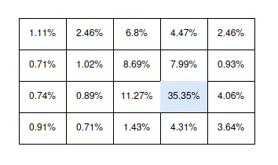
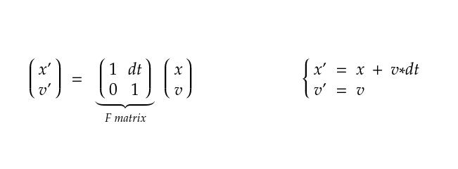
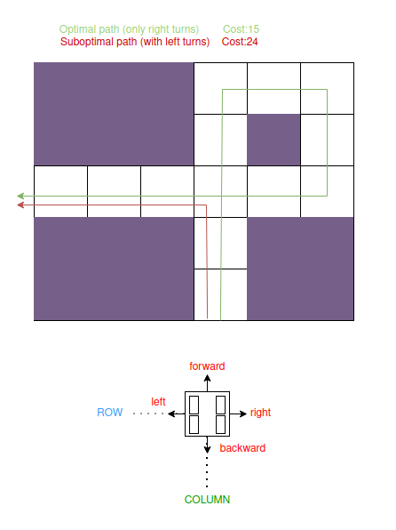
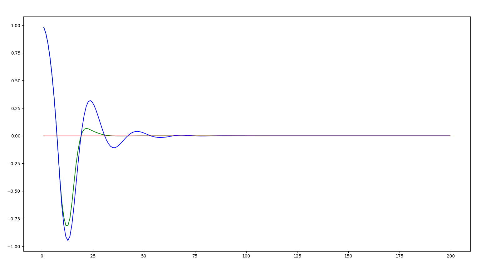

# **AI For Robotics**

### This repository aims to add documentation, optimize in terms of memory and execution times and clean up the code used throughout [*Sebastian Thrun's course **"Artificial Intelligence for Robotics"***](https://www-origin-contentful-preview.udacity.com/). 

#### The different modules of the repository are explained in detail below.

- [Localization with Total Probability](localization_total_probability/README.md)
- [Kalman Filter](kalman_filter/README.md)
- [Particle Filter](particle_filter/README.md)
- [Search Algorithms](search/README.md)
- [PID Control](pid_control/README.md)
- [Graph SLAM](slam/README.md)

> Sebastian Thrun's course "Artificial Intelligence for Robotics": 
> https://www-origin-contentful-preview.udacity.com/

## Image of the modules

|                                              Localization with total probability                                               |                                            Kalman Filter                                             |
|:------------------------------------------------------------------------------------------------------------------------------:|:----------------------------------------------------------------------------------------------------:|
|  |  |

|                                           Particle Filter                                            |                                   Search Algorithms                                    |
|:----------------------------------------------------------------------------------------------------:|:--------------------------------------------------------------------------------------:|
|  |   |

|                                               PID Control                                               |                                       Graph SLAM                                        |
|:-------------------------------------------------------------------------------------------------------:|:---------------------------------------------------------------------------------------:|
|  |  |

