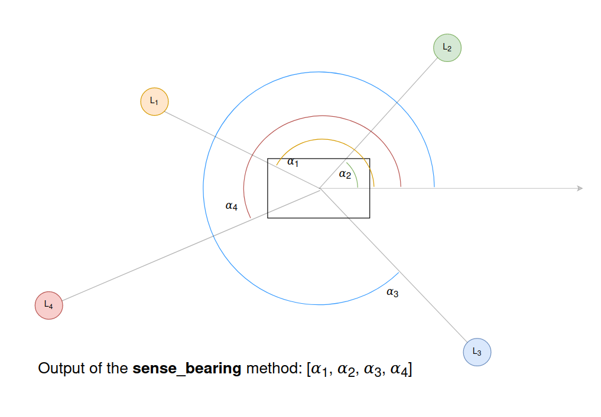
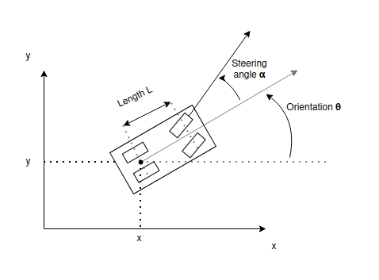
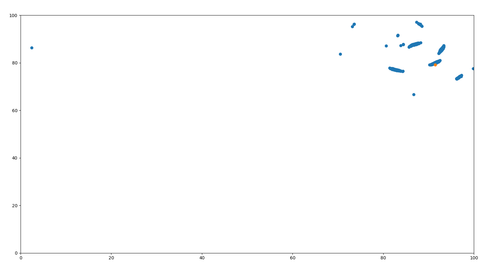

# Particle Filter

> This module contains three submodules: **circular_motion**, **particle_filter_sensing** and **particle_filter**

<details>
    <summary>Circular Motion</summary>

## Circular Motion

This module is used to test that the **circular_motion** method of the **Robot** class performs the circular 
movement of the robot correctly.

- The motion of the Robot, which in this case has 4 wheels, is approximated to the motion of a bicycle with the same 
length between the front and back wheels as the robot. 
- The state of the robot is defined by its x and y coordinates, 
and by the robot's orientation, which is the angle between the robot's orientation and the x-axis. 
- The motion depends on the distance that the robot travels per timestep, and the steering angle of the front 
wheels, which is the angle between the orientation of the front wheels and the orientation of the robot.


The equations and diagram used to calculate the position of the robot in the next timestep are shown in 
the following image:


If the turning angle 𝛽 is very low the motion can be considered rectilinear, in which case the following equations 
are used for calculating the next position and orientation of the robot:

```math
x' = x + cos(\theta) * d
y' = y + sin(\theta) * d
\theta' = (\theta + \beta) mod 2\pi
```

</details>

<details>
    <summary>Particle Filter Sensing of Landmarks</summary>

## Particle Filter Sensing

This module is used to test that the **sense_bearing** method of the **Robot** class correctly outputs the angles 
between the robot's orientation and the position of the landmarks.


</details>

<details>
    <summary>Particle Filter Localization</summary>

## Particle Filter

This module creates 1000 particles, which are instances of the Robot class, with the same noise parameters 
as the real robot. After this, for each timestep:

1. The real robot is rotated a random angle and moved for a random distance, and the distance from the robot to each landmark is measured.
2. The same motion is applied to each particle.
3. Each particle is weighted by comparing the sensing of the real robot of the landmarks and the
    sensing of each particle fo the landmarks. The probability/weight of each particle is calculated 
    as how likely it is that the real robot's position is the particle's position, following a Gaussian 
    distribution where the mean is the difference between the distances measured by the real robot and each
    particle, and the variance is the measurement noise of the robot. 
    
    

4. Resample the particles by following the Resampling Wheel algorithm.
5. Calculate the mean error of the particles, where each error is calculated as the absolute distance 
between the particle's real position and the robot's real position.

In the video *doc_images/particle_filter.mp4*  the particle filter takes 10 iterations to highly reduce the error and predict the real robot's 
location accurately.

</details>

# Example Images

|                                              Bearing Sensing                                              |                                               Circular Motion                                               | Particle Filter                                                                                          |
|:---------------------------------------------------------------------------------------------------------:|:-----------------------------------------------------------------------------------------------------------:|:---------------------------------------------------------------------------------------------------------|
|  |  |     |
