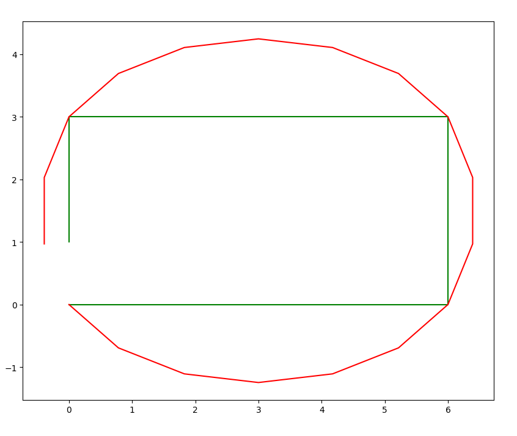
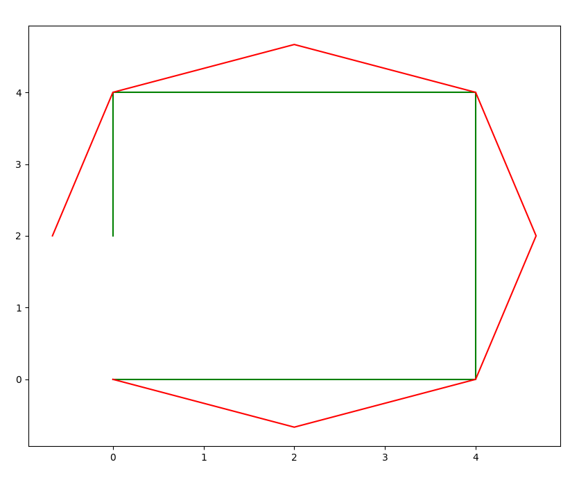
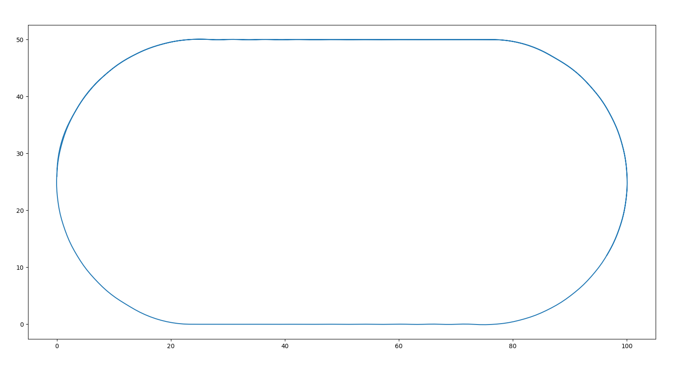

# PID Control

> This module contains three submodules: **constrained_smoothing**, **pid_controller_twiddle** and **racetrack_control**

    
Constrained Smoothing

## Constrained Smoothing

This module uses Gradient Descent to smooth the path to be followed by the robot. The smoothing process in 
constrained, as some points must be fixed (the four vertices of the square). The smoothed path has 
many states as the original path.
The two different paths used to test the smoothing process are shown in green in the figures below, 
and the smoothed path is shown in red.

 

    
PID Controller Twiddle

## PID Controller Twiddle

This modules applies the Twiddle algorithm to obtain the optimal parameters for a PID Controller which 
tries to adjust the robot to a straight horizontal line. The module then tests a PID Controller initialized 
with random parameters (but close to the optimal ones) and the PID Controller obtained from the Twiddle algorithm.

The following image shows the results of the Twiddle-optimized PID Controller in green, and the results of the PID Controller 
with near-optimal parameters in blue.

    
Racetrack Control

## Racetrack Control

This module uses a PID Controller to navigate the Robot through a racetrack. The racetrack is shaped like a 
roman racetrack, and the crosstrack error is computed as the distance from the robot to the track.

The following image shows the path described by the robot after moving following the track for 200 timesteps.

# Example Images

|                                       Constrained Smoothing                                       |                                           PID Controller Twiddle                                           | Racetrack Control                                                                                     |
|:-------------------------------------------------------------------------------------------------:|:----------------------------------------------------------------------------------------------------------:|:------------------------------------------------------------------------------------------------------|
|  |    |    |

