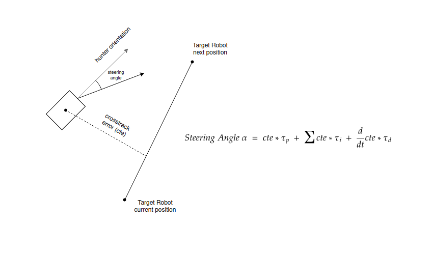
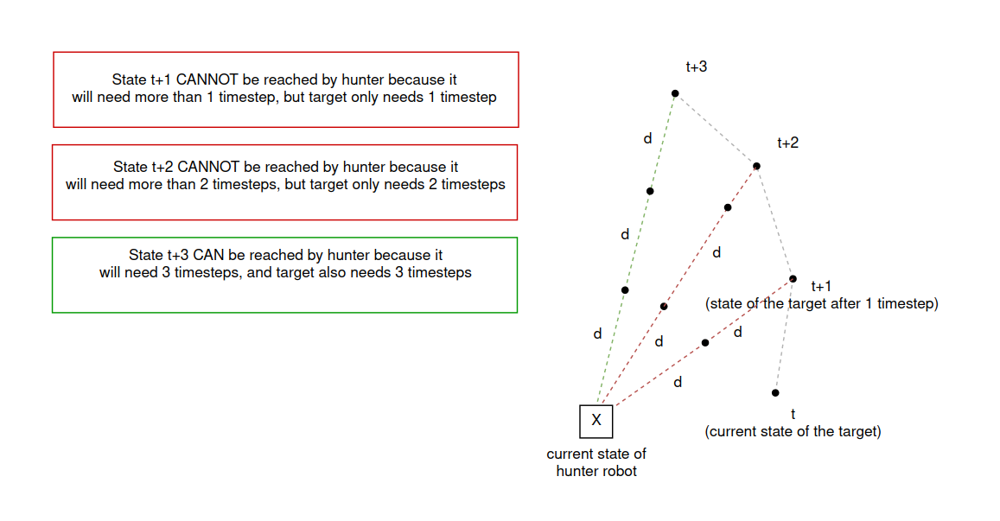

# Runaway Robot

This module tries to catch a robot which is moving in circles without control. 
The module contains 4 functionalities:

- Estimate the target Robot's next position when the measurements taken by the robot are not noisy. As the 
  measurements received are not noisy, only 3 timesteps are required for calculating the next position:
  - **Timestep 1**: The position measurements of the target robot are stored.
  - **Timestep 2**: From the previous position measurements and the current ones, the orientation of the robot in 
    the current state is obtained as the direction of the vector which joins the previous and the current position. 
    The velocity of the target robot is also calculated, as the length of the vector which joins the previous and 
    the current position. Finally, the current position, orientation and velocity of the target robot 
    are stored.
  - **Timestep 3**: Finally, in the last timestep the target robot's velocity and orientation are calculated as before, 
    and the last parameter, the turning angle, is calculated as the angle between the previous orientation and 
    the current one. Once the current position, orientation, velocity and turning angle of the robot are obtained, 
    the next position of the target robot can be calculated as:
    
        x' = x + cos(θ + β) * v
        y' = y + sin(θ + β) * v
        where v = velocity
              θ = orientation
              β = turning angle
  
- Estimate the target Robot's next position when the measurements taken by the robot are noisy. Due to the noisy 
  measurements, the estimate for the target robot's next position is calculated using a Kalman Filter.
  
- Calculate the next move to be taken by the hunter robot to reach the target robot, when the velocity of 
  the hunter robot is almost twice the velocity of the target robot. The approach taken to capture the 
  target robot is to create a track segment to be followed by the hunter robot, which is a line which joins the 
  current position of the target robot and the expected next state. The hunter robot follows this segment according 
  to a PID Controller, where the crosstrack error is the closest distance between the hunter robot and the segment. 
  The steering angle of the hunter robot is given by the PID Controller, and the velocity of the hunter robot 
  is equal to the distance from hunter to target robot. If this velocity is higher than the maximum velocity allowed, 
  then velocity is set to the maximum velocity.
  
  

  

- Calculate the next move to be taken by the hunter robot to reach the target robot, when the velocity of 
  the hunter robot is slightly lower than teh velocity of the target robot. The approach taken to capture the 
  target robot is to calculate which of the next steps to be reached by the target robot are accessible from the 
  hunter robot with its given velocity. In other words, the hunter will aim for future states of the target robot, 
  because it is unable to reach the next state of the target robot, as the target moves faster than the hunter. 
  Therefore, being the current state t, if the target robot will reach state t+3 after 3 timesteps with its velocity, 
  and if the hunter robot can reach the same state t+3 after 3 timesteps with its velocity, then it will aim to that 
  t+3 state, instead of aiming to t, t+1 or t+2, where the target robot would get before the hunter.
  
  
  
  
