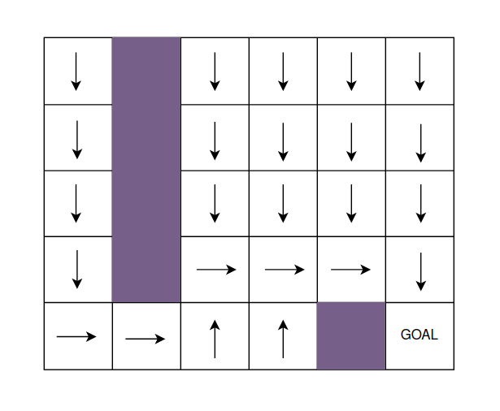
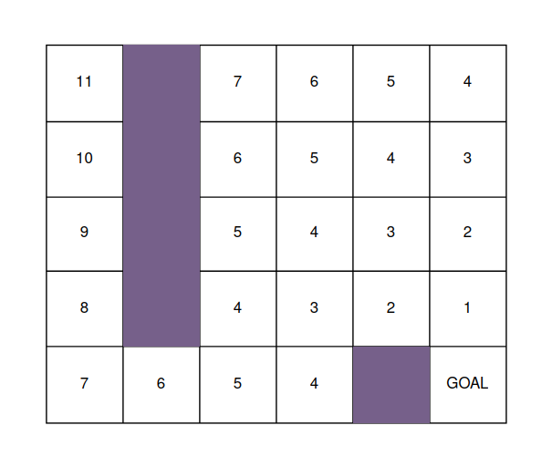
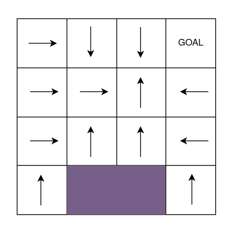
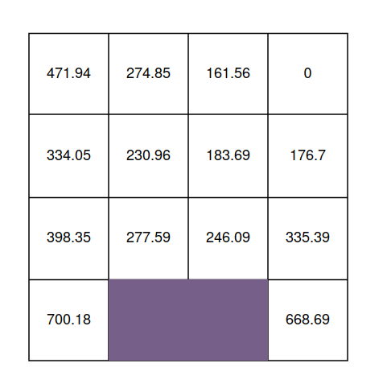
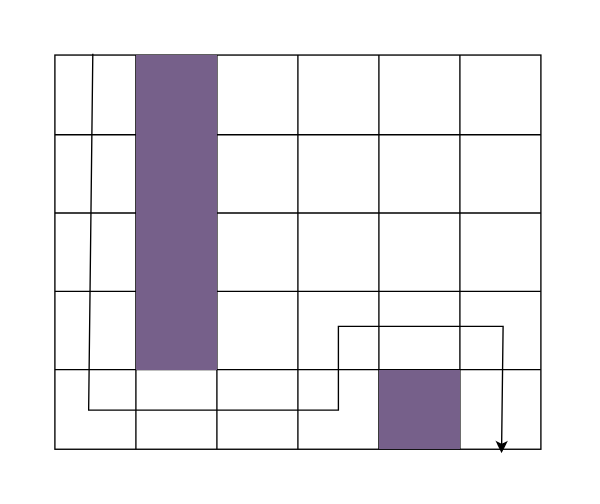
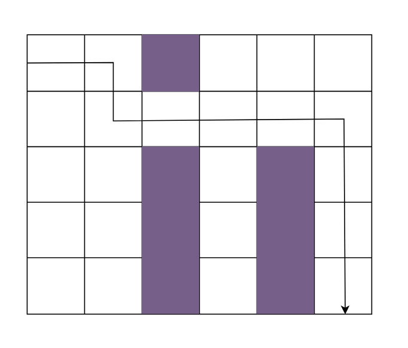

# Search

> This module contains five submodules: **2d_policy**, **astar**, 
> **first_search**, **optimal_policy** and **stochastic_motion**

    
2D Policy

## 2D Policy

This module applies Dynamic Programming to obtain the value of each state on the 
grid, and the optimal policy from each state. The value of a state is the lowest possible cost for reaching 
the goal position from the given state, and the optimal policy indicated the best action to take from 
each state. 

The agent's state is given by 3 attributes: the x and y position and the orientation. Because of this, the value matrix 
is a 3D matrix, which corresponds to as many 2D value matrices as possible orientations of the agent. The initial state 
of the agent is row=4, col=3, and the cost of moving forward is 1, the cost of turning left is 20 and the cost of 
turning right is 2.

    
A* Algorithm

## A* Algorithm

This module executes the A* algorithm to find the optimal path between an initial state and a goal state. The 
optimal path returned by the algorithm is the one shown in the following image:

    
First Search Algorithm

## First Search Algorithm

This module executes the First Search algorithm to find the optimal path between an initial state and a goal state. The 
optimal path returned by the algorithm is the one shown in the following image:

    
Optimal Policy

## Optimal Policy

This module uses Dynamic Programming to find the optimal policy for reaching a given goal state. The 
optimal policy returned by the algorithm, and the value of each state, are shown in the following images:

 

    
Stochastic Motion

## Stochastic Motion

This module uses Dynamic Programming to find the optimal policy for reaching a given goal state, when the motion of 
the robot is stochastic. The robot has a 50% chance of failure when moving forward, which would mean that the 
robot moves either rights or left. Because of the stochasticity of the Robot's motion, the robot should consider 
stochastic collisions when navigating very close to a wall, thus decreasing the value of those states. The optimal 
policy returned by the algorithm, and the value of each state, are shown in the following images:

 

# Example Images

|                                       2D Policy                                        |                                          A* Algorithm                                           | First Search Algorithm                                                                                 |
|:--------------------------------------------------------------------------------------:|:-----------------------------------------------------------------------------------------------:|:-------------------------------------------------------------------------------------------------------|
|  |  |  |

|                                                 Optimal Policy                                                  |                                           Stochastic Motion                                           |
|:---------------------------------------------------------------------------------------------------------------:|:-----------------------------------------------------------------------------------------------------:|
|  |  |

