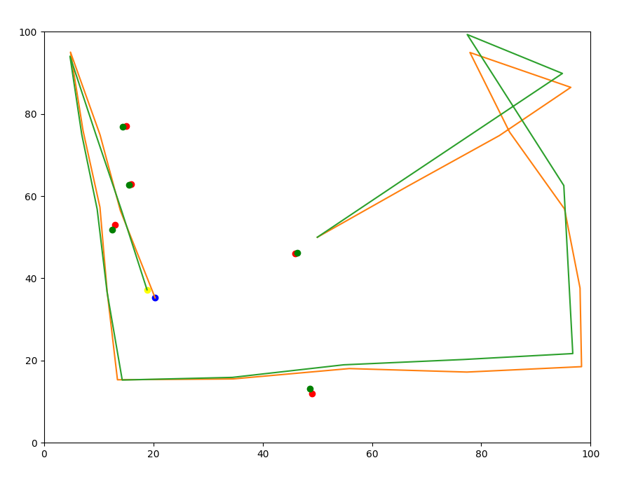
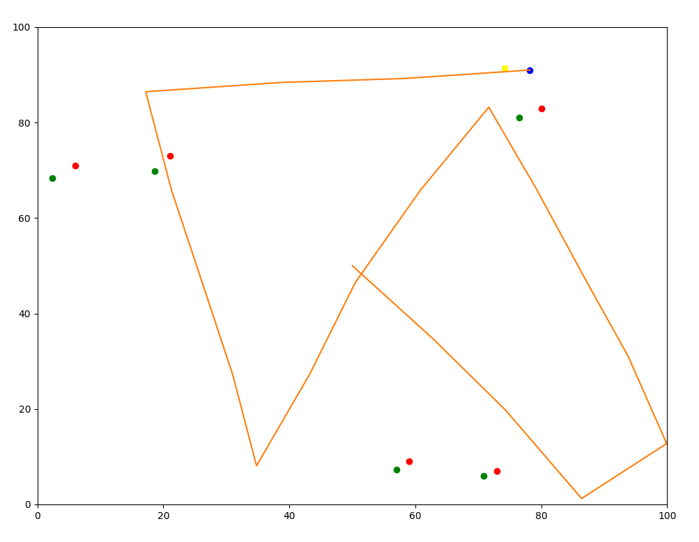
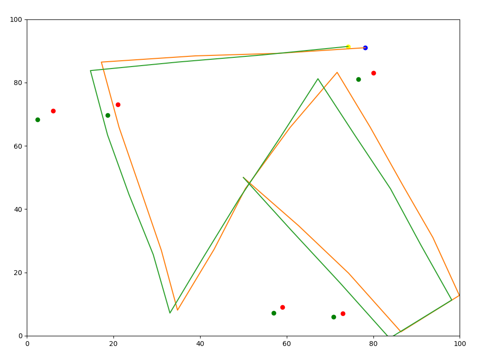

# Graph SLAM

> This module contains four submodules: **graph_slam_2d**, **scalable_graph_slam** and **segmented_cte**

    
Graph SLAM 2D

## Graph SLAM 2D

This module applies the Graph SLAM algorithm, which locates the Robot and 
the landmarks at the same time, thus being able to localize itself while creating a map. 

The image below shows the real position of both the robot and the landmarks, together with the positions 
estimated by the Graph SLAM algorithm. The true position of the landmarks are shown as red dots, the true position 
position of the robot is shown as a blue dot, the estimate positions for the landmarks are shown as green dots, 
and the estimate position of the robot is shown as a yellow dot. Finally, the real trajectory followed by the 
robot is shown in orange, and the estimated trajectory of the robot is shown in green.

    
Scalable Graph SLAM

## Scalable Graph SLAM

This module applies the Scalable Graph SLAM algorithm, which works in the same way as the Graph SLAM algorithm, 
but works with an Omega matrix which only needs to store the localization of the landmarks and the last position 
of the robot, instead of storing the position of the landmarks and the position of every state visited by the robot. 

The image below shows the real position of both the robot and the landmarks, together with the positions 
estimated by the Graph SLAM algorithm. The true position of the landmarks are shown as red dots, the true position 
position of the robot is shown as a blue dot, the estimate positions for the landmarks are shown as green dots, 
and the estimate position of the robot is shown as a yellow dot. Finally, the real trajectory followed by the 
robot is shown in orange. As the Graph SLAM only stores the robot's last state, it is not possible to plot 
the estimate trajectory of the robot from the SLAM algorithm's output.

 

    
Segmented CTE

## Segmented CTE

This module creates an autonomous navigation system for the robot, following these steps:
1. Plan the optimal path to the goal state using A* algorithm.
2. Smooth the optimal path.
3. Initialize the real Robot, and the Particle Filter of 100 particles with the same position and orientation as the real robot, 
and same steering, distance and measurement noise.
4. The robot's steering angle on each timestep is given by a PID Controller which tries to minimize 
the crosstrack error, which is the distance from the robot to the closest point of the smoothed path. The distance 
from the robot to the track is measured considering the position estimated by the Particle Filter.
5. After the motion is applied, measurements are taken from the robot's new positions, and the particles of the 
Particle Filter are resampled.

In the following image the path followed by the Robot is shown in green, and the smoothed optimal path is shown in red.

# Example Images

|                                              Graph SLAM 2D                                                |                                               Scalable Graph SLAM                                   | Segmented CTE                                                                            |
|:---------------------------------------------------------------------------------------------------------:|:---------------------------------------------------------------------------------------------------:|:-----------------------------------------------------------------------------------------|
|                      |                |     |

