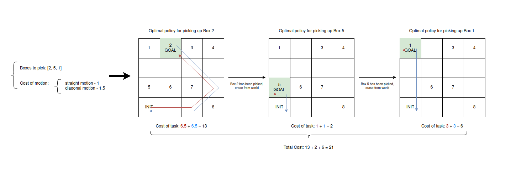

# Warehouse Robot

This module calculates the optimal policy, together with the cost of executing the task, for a warehouse robot. The 
warehouse robot is initialized in a grid world where empty cells (navigable states) and boxes are present (non 
navigable states). The boxes are represented with positive integers on the grid, being these integers the 
corresponding identifiers of the boxes. 

The robot will receive a sequence of integers, which represent each the boxes that the robot will need to pick up, in 
the given order. The robot's task, then, is to, starting from an initial position, pick up the given box (a box is 
picked up when the robot reaches the box position) and take it back to the starting position. After this, the 
grid no longer contains the picked up box, and so the grid cell which previously contained the box is now 
a navigable cell. The steps to complete the task for a random environment/grid are shown below:

